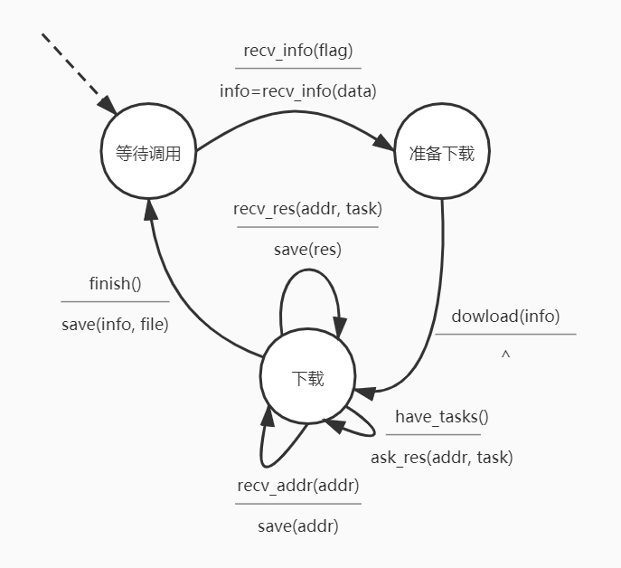
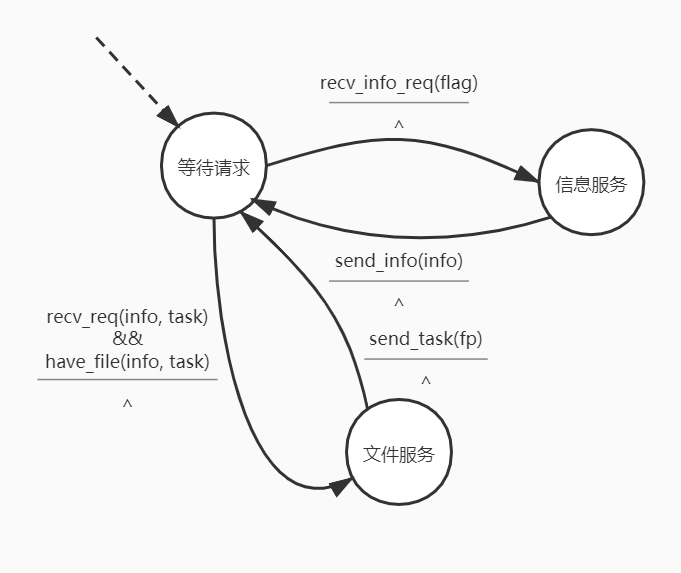

# NetTransmission

## 简介

[web端](https://github.com/Ghost-LZW/WebNetTransmission)采用vue+nwjs实现

android使用原生android实现

使用socket基于tcp进行传输

基于p2p, 使用自定义p2p协议

### 客户端FSM

### 服务端FSM

## 协议简介

### 工作模式

将文件分割为多个任务点，按任务点进行服务

初始为单个任务点，任务点为0:文件大小

若无空闲任务点，则在所有任务点中找出未完成的最大任务点，分割为两份，新建任务点进行工作

当客服端接受到任意任务点，当作为服务端对其他客户端进行服务，对于每个请求，在本地查看是否为未完成任务点，若未，则返回失败请求

每次新客服端接入，服务端记录未新的服务地址，并向后来客户端暴露 (可选

### 协议格式

此协议中文本无特殊标记全为utf-8

* 请求长度 -- 3 Byte
* 协议版本 -- 以'\n'结尾
* 请求标志 -- 1 Byte
* 文件名长度 -- 1 Byte
* 文件名 -- 限定长度小于256
* 文件大小 -- 6 Byte
* (下载请求)任务点 -- 6 Byte
* (下载回复)任务点大小 -- 3Byte
* (下载回复)文件内容 -- 默认256KB
* 服务点信息 -- 可选
* 附加信息 -- 可选

本协议使用经典256KB文件块

0.1版本使用类似http1.0的每次建立tcp连接方式实现

#### 请求文件基本信息

将请求标志置为'1', 后续为空

请求发往文件服务器

#### 发送文件基本信息

将请求标准置为'2'，后续为空

请求发往客户端

#### 请求文物